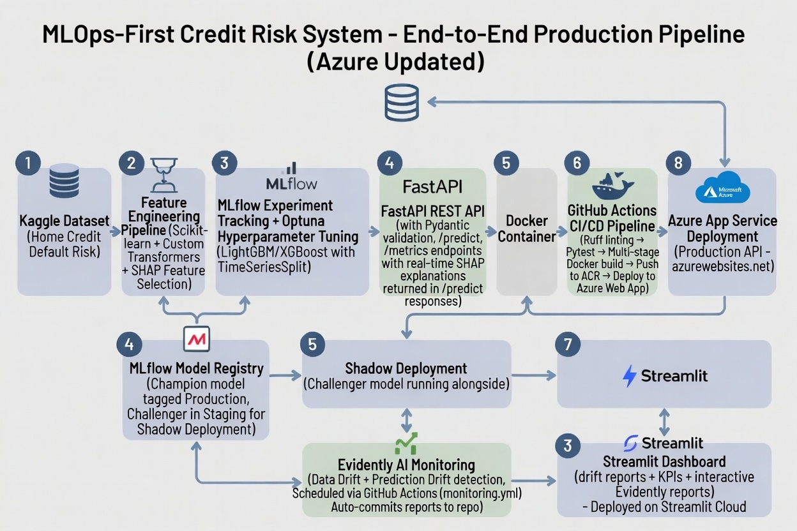

# 🏦 MLOps-First Credit Risk System

> End-to-end production ML pipeline for predicting loan defaults — from raw data to live API with automated monitoring.

[](https://github.com/AmarjeetJha17/mlops-credit-risk-system/actions/workflows/ci-cd.yml)
[](https://github.com/AmarjeetJha17/mlops-credit-risk-system/actions/workflows/monitoring.yml)
[](https://app-credit-risk-api-1777604735.azurewebsites.net/docs)
[](https://mlops-credit-risk-system.streamlit.app)

---

## Architecture



---

## Table of Contents

- [Overview](#overview)
- [Key Features](#key-features)
- [Tech Stack](#tech-stack)
- [Project Structure](#project-structure)
- [Getting Started](#getting-started)
  - [Prerequisites](#prerequisites)
  - [Local Development](#local-development)
  - [Docker](#docker)
- [API Endpoints](#api-endpoints)
- [MLOps Pipeline](#mlops-pipeline)
  - [Training & Experiment Tracking](#1-training--experiment-tracking)
  - [Model Registry & Shadow Deployment](#2-model-registry--shadow-deployment)
  - [CI/CD Pipeline](#3-cicd-pipeline)
  - [Production Monitoring](#4-production-monitoring)
- [Live Deployments](#live-deployments)
- [Dataset](#dataset)
- [License](#license)

---

## Overview

This project demonstrates a **production-grade MLOps pipeline** built around the [Home Credit Default Risk](https://www.kaggle.com/c/home-credit-default-risk) dataset. It goes beyond a Jupyter notebook to implement every stage of the ML lifecycle — feature engineering, experiment tracking, model versioning, containerized deployment, shadow testing, and automated drift monitoring.

The system answers a single business question: **"Will this loan applicant default?"** — and wraps that answer in a robust, observable, continuously deployable service.

---

## Key Features

| Category | Capability |
|---|---|
| **Feature Engineering** | Custom scikit-learn transformers generating domain-specific financial ratios (debt-to-income, credit utilization, employment stability) |
| **Experiment Tracking** | MLflow integrated with Azure ML workspace tracking 4 model baselines (Logistic Regression, Random Forest, LightGBM, XGBoost) across cross-validation folds |
| **Hyperparameter Tuning** | Optuna Bayesian optimization with TimeSeriesSplit to prevent data leakage |
| **Explainability** | Real-time SHAP values on every prediction — top 5 contributing features returned in the API response |
| **Shadow Deployment** | Champion (Production) and Challenger (Staging) models loaded concurrently; shadow predictions logged for comparison without affecting users |
| **CI/CD** | GitHub Actions → Ruff lint → Pytest → Docker build → Azure ACR push → Azure Web App deploy |
| **Monitoring** | Evidently AI data drift detection running on a scheduled GitHub Actions workflow |
| **Dashboard** | Streamlit Cloud dashboard displaying drift KPIs and interactive Evidently reports |

---

## Tech Stack

| Layer | Technology |
|---|---|
| **Language** | Python 3.11 |
| **ML Models** | LightGBM, XGBoost, Scikit-learn |
| **Experiment Tracking** | MLflow (Azure ML backend) |
| **Hyperparameter Tuning** | Optuna |
| **Explainability** | SHAP |
| **API Framework** | FastAPI + Pydantic v2 |
| **Containerization** | Docker (multi-stage build) |
| **CI/CD** | GitHub Actions |
| **Container Registry** | Azure Container Registry (ACR) |
| **Cloud Deployment** | Azure App Service |
| **Monitoring** | Evidently AI |
| **Dashboard** | Streamlit |
| **Load Testing** | Locust |

---

## Project Structure

```
mlops-credit-risk-system/
├── .github/workflows/
│   ├── ci-cd.yml                 # Lint → Test → Build → Push → Deploy
│   └── monitoring.yml            # Scheduled drift detection pipeline
├── dashboard/
│   ├── app.py                    # Streamlit monitoring dashboard
│   ├── requirements.txt          # Lightweight deps for Streamlit Cloud
│   └── reports/                  # Auto-generated Evidently HTML/JSON reports
├── data/raw/                     # Kaggle dataset (not committed)
├── docs/
│   └── architecture.jpg          # System architecture diagram
├── models/
│   ├── preprocessing_pipeline.joblib
│   └── top_features.joblib
├── mlruns/                       # MLflow local experiment artifacts (legacy)
├── notebooks/
│   └── eda.py                    # Exploratory data analysis
├── reports/figures/              # SHAP plots, confusion matrices
├── src/
│   ├── api/
│   │   ├── main.py               # FastAPI app with shadow deployment
│   │   ├── model_loader.py       # Model loading utilities
│   │   └── schemas.py            # Pydantic request/response models
│   ├── features/
│   │   ├── build_features.py     # Feature pipeline orchestration
│   │   ├── pipeline.py           # Scikit-learn pipeline definition
│   │   └── transformers.py       # Custom DomainFeatureGenerator
│   ├── models/                   # Model selection utilities
│   ├── monitoring/
│   │   └── drift_detector.py     # Evidently AI drift analysis
│   └── training/
│       ├── train.py              # Multi-model baseline training
│       ├── optuna_tuning.py      # Bayesian hyperparameter search
│       └── register_model.py     # MLflow Model Registry promotion
├── tests/
│   ├── test_features.py          # Feature pipeline unit tests
│   └── locustfile.py             # Load testing configuration
├── Dockerfile                    # Multi-stage production build
├── docker-compose.yml            # Full stack (API + MLflow + Monitoring)
├── Makefile                      # Convenience commands
├── .env                          # Azure ML tracking URI (not committed)
├── mlflow.db                     # MLflow local tracking database (legacy)
└── requirements.txt              # Full project dependencies
```

---

## Getting Started

### Prerequisites

- **Python 3.11+**
- **Docker** (optional, for containerized deployment)
- **Azure CLI** (logged in with `az login` for Azure ML access)
- **Kaggle Dataset**: Download `application_train.csv` from [Home Credit Default Risk](https://www.kaggle.com/c/home-credit-default-risk) and place it in `data/raw/`
- **`.env` file** with `AZURE_ML_MLFLOW_URI` set to your Azure ML MLflow tracking URI

### Local Development

```bash
# Clone the repository
git clone https://github.com/AmarjeetJha17/mlops-credit-risk-system.git
cd mlops-credit-risk-system

# Create and activate virtual environment
python -m venv venv
venv\Scripts\activate        # Windows
# source venv/bin/activate   # macOS/Linux

# Install dependencies
pip install -r requirements.txt

# Run the feature engineering pipeline
python src/features/build_features.py

# Train baseline models (logs to MLflow)
python src/training/train.py

# Run hyperparameter tuning
python src/training/optuna_tuning.py

# Register the best model to MLflow Model Registry
python src/training/register_model.py

# Start the API server
uvicorn src.api.main:app --reload --host 0.0.0.0 --port 8000

# View experiments in Azure ML Studio
# Navigate to: https://ml.azure.com → Your Workspace → Experiments
```

### Docker

```bash
# Build and start all services
docker-compose up --build -d

# Or use the Makefile
make build
make up

# Check logs
make logs
```

---

## API Endpoints

Once running, visit the interactive docs at **http://localhost:8000/docs**

| Method | Endpoint | Description |
|---|---|---|
| `GET` | `/health` | Service health check |
| `GET` | `/metrics` | Model metadata (version, ROC-AUC, training date) |
| `POST` | `/predict` | Loan default prediction with SHAP explanations |

### Example: Predict Endpoint

**Request:**
```bash
curl -X POST http://localhost:8000/predict \
  -H "Content-Type: application/json" \
  -d '{
    "AMT_INCOME_TOTAL": 150000.0,
    "AMT_CREDIT": 500000.0,
    "AMT_ANNUITY": 25000.0,
    "DAYS_EMPLOYED": -1200,
    "DAYS_BIRTH": -10000,
    "NAME_CONTRACT_TYPE": "Cash loans",
    "CODE_GENDER": "F",
    "FLAG_OWN_CAR": "Y",
    "FLAG_OWN_REALTY": "Y"
  }'
```

**Response:**
```json
{
  "prediction": 0,
  "probability": 0.0823,
  "feature_contributions": {
    "CREDIT_TO_INCOME_RATIO": 0.142,
    "INC_TO_ANNUITY_RATIO": -0.089,
    "DAYS_EMPLOYED": 0.076,
    "AMT_CREDIT": -0.054,
    "EMPLOYED_TO_AGE_RATIO": 0.031
  },
  "model_version": "1"
}
```

---

## MLOps Pipeline

### 1. Training & Experiment Tracking

- Four baseline models trained with **TimeSeriesSplit** cross-validation to simulate temporal out-of-sample evaluation
- All metrics (ROC-AUC, F1, Log Loss), parameters, and artifacts (confusion matrices, SHAP plots) logged to **MLflow**
- **Optuna** performs Bayesian hyperparameter optimization on the champion model architecture

### 2. Model Registry & Shadow Deployment

- The best-performing model is promoted to **Production** stage in the MLflow Model Registry
- A challenger model can be promoted to **Staging** for shadow testing
- During inference, both models score every request — the Production model returns the response while the Staging model's prediction is **logged silently** for offline comparison:

```
SHADOW_LOG | RequestID: abc123 | Champion_Prob: 0.0823 | Challenger_Prob: 0.0915
```

### 3. CI/CD Pipeline

Every push to `master` triggers a fully automated pipeline:

```
Ruff Lint → Pytest → Docker Build → Push to Azure ACR → Deploy to Azure Web App
```

- **Linting**: Ruff enforces code quality and formatting standards
- **Testing**: Pytest validates feature engineering outputs and model assumptions
- **Build**: Multi-stage Docker image minimizes production footprint
- **Registry**: Image pushed to Azure Container Registry (ACR)
- **Deploy**: Azure Web App pulls and deploys the latest container image

### 4. Production Monitoring

- **Evidently AI** detects data drift and prediction drift by comparing reference and current data distributions
- Drift detection runs on a **scheduled GitHub Actions workflow** and auto-commits updated reports
- A **Streamlit dashboard** visualizes drift KPIs (healthy/drifted status, drift share percentage) and embeds the full interactive Evidently report

---

## Live Deployments

| Service | URL |
|---|---|
| **Production API** | [app-credit-risk-api-1777604735.azurewebsites.net](https://app-credit-risk-api-1777604735.azurewebsites.net/docs) |
| **Azure ML Studio** | [ml.azure.com](https://ml.azure.com) — Experiment tracking, model registry, and monitoring |
| **Monitoring Dashboard** | [mlops-credit-risk-system.streamlit.app](https://mlops-credit-risk-system.streamlit.app) |

---

## Dataset

This project uses the [Home Credit Default Risk](https://www.kaggle.com/c/home-credit-default-risk) dataset from Kaggle. The dataset contains 307,511 loan applications with 122 features. The target variable (`TARGET`) indicates whether a client had payment difficulties (1 = default, 0 = repaid).

**Custom domain features engineered:**
- `INC_TO_ANNUITY_RATIO` — Debt-to-income proxy
- `CREDIT_TO_ANNUITY_RATIO` — Loan term / credit utilization proxy
- `CREDIT_TO_INCOME_RATIO` — Borrowing multiplier
- `EMPLOYED_TO_AGE_RATIO` — Employment stability indicator

---

## License

This project is open source and available under the [MIT License](LICENSE).
